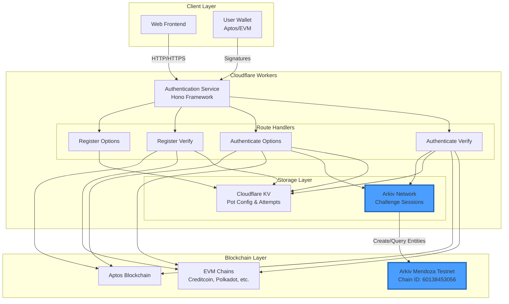
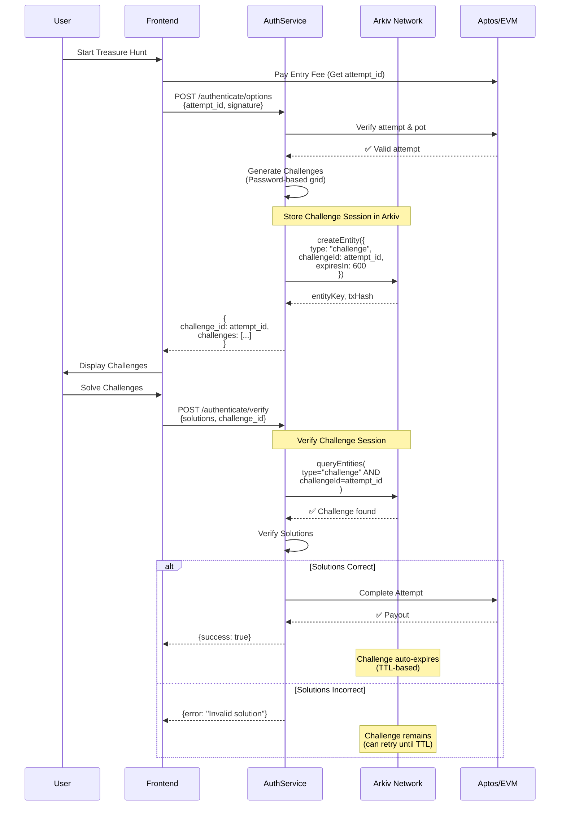
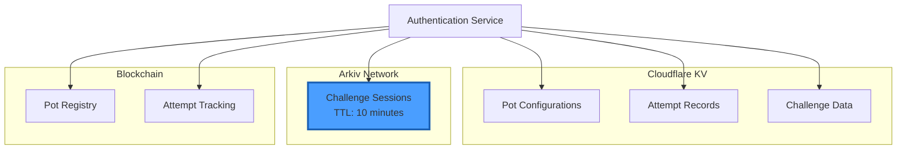
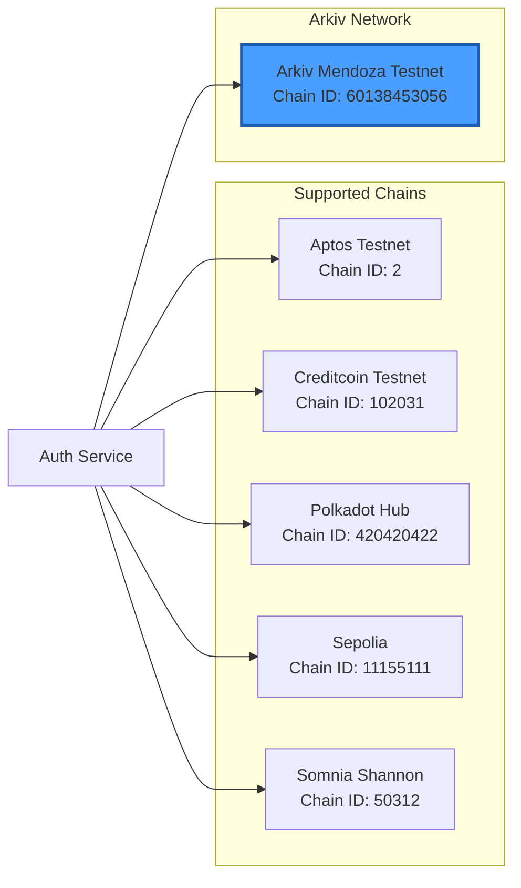
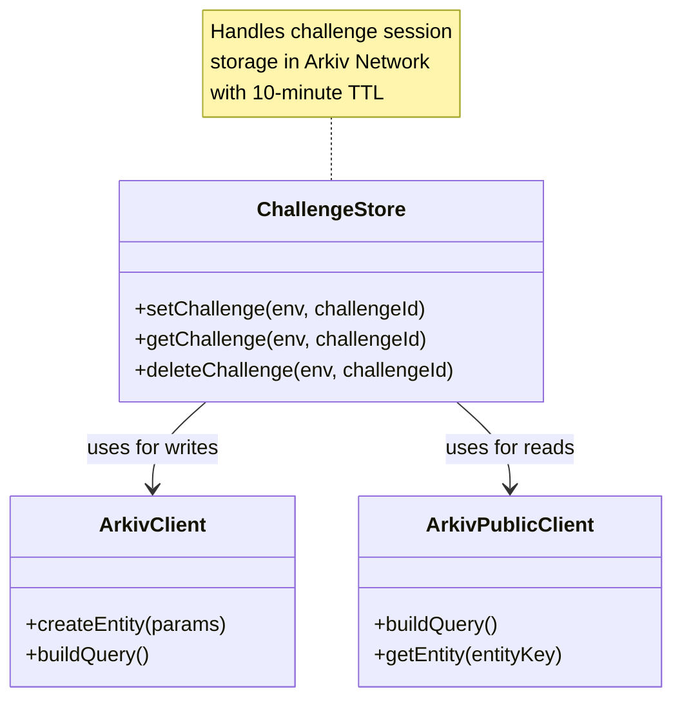
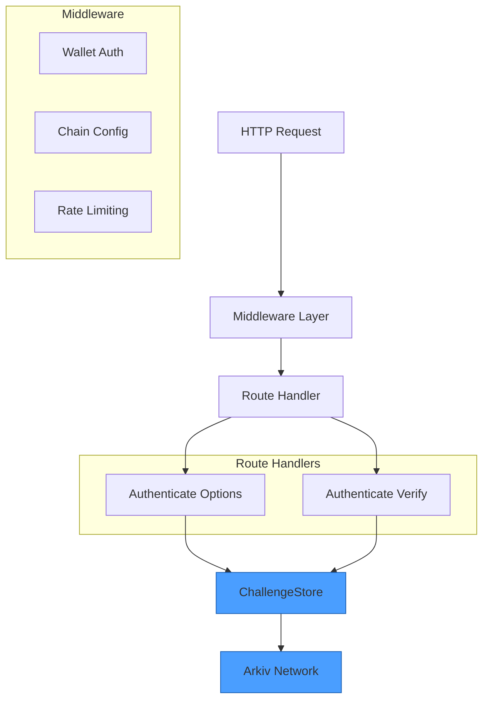
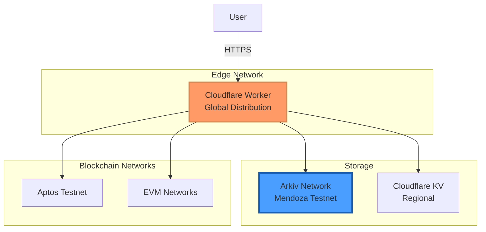

# MoneyPot Authentication Service - Architecture

## 🎯 Arkiv Network Integration

MoneyPot Authentication Service uses **Arkiv Network** as a decentralized storage layer for challenge session management, replacing traditional centralized key-value storage with an Ethereum-based data layer that provides automatic TTL (Time-To-Live) expiration.

## Architecture Overview



## Challenge Session Flow with Arkiv



## Arkiv Integration Details

### Why Arkiv?

MoneyPot replaced **Cloudflare KV** with **Arkiv Network** for challenge session storage because:

1. **Decentralized**: No dependency on Cloudflare's centralized storage
2. **Automatic Expiration**: Built-in TTL eliminates need for manual cleanup
3. **Cost-Effective**: Ethereum-based storage with predictable costs
4. **Transparent**: All challenge sessions are queryable on-chain
5. **Resilient**: Distributed storage reduces single point of failure

### Arkiv Implementation

#### Storage Pattern

```typescript
// Creating a challenge session in Arkiv
const { entityKey, txHash } = await walletClient.createEntity({
  payload: stringToPayload("active"),
  contentType: "text/plain",
  attributes: [
    { key: "type", value: "challenge" },
    { key: "challengeId", value: attempt_id },
  ],
  expiresIn: 10 * 60, // 10-minute expiry
})
```

#### Query Pattern

```typescript
// Querying challenge sessions
const results = await publicClient
  .buildQuery()
  .where([eq("type", "challenge"), eq("challengeId", attempt_id)])
  .fetch()
```

### Data Flow Diagram

```mermaid
graph LR
    subgraph "Challenge Lifecycle"
        CREATE[1. Create Challenge<br/>POST /authenticate/options]
        STORE[2. Store in Arkiv<br/>createEntity]
        QUERY[3. Verify Challenge<br/>POST /authenticate/verify]
        EXPIRE[4. Auto-Expire<br/>TTL: 10 minutes]
    end

    subgraph "Arkiv Entity Structure"
        ENTITY[Entity]
        ATTRS[Attributes:<br/>- type: challenge<br/>- challengeId: xxx]
        PAYLOAD[Payload:<br/>"active"]
        TTL[TTL:<br/>600 seconds]
    end

    CREATE --> STORE
    STORE --> ENTITY
    ENTITY --> ATTRS
    ENTITY --> PAYLOAD
    ENTITY --> TTL

    QUERY --> ENTITY
    TTL --> EXPIRE

    style ENTITY fill:#4a9eff,stroke:#1a5fb3
    style STORE fill:#90ee90,stroke:#228b22
    style QUERY fill:#ffd700,stroke:#daa520
    style EXPIRE fill:#ff6347,stroke:#cd5c5c
```

## System Components

### Storage Layer Architecture



### Multi-Chain Support



## Code Architecture

### Challenge Store Implementation

The `ChallengeStore` class (`src/db/challengeStore.ts`) is the primary interface to Arkiv:



### Request Flow



## Deployment Architecture



## Benefits of Arkiv Integration

1. **Decentralization**: Challenge sessions stored on Ethereum-based Arkiv Network
2. **Automatic Cleanup**: TTL-based expiration eliminates manual session management
3. **Transparency**: All challenge sessions queryable on-chain
4. **Cost Efficiency**: Predictable storage costs with automatic expiration
5. **Resilience**: Distributed storage reduces dependency on centralized services

## Technical Implementation

### Arkiv SDK Usage

```typescript
// Client creation
const walletClient = createWalletClient({
  chain: mendoza,
  transport: http(rpcUrl, { fetchFn: globalThis.fetch }),
  account: privateKeyToAccount(privateKey),
})

// Public client for queries
const publicClient = createPublicClient({
  chain: mendoza,
  transport: http(rpcUrl, { fetchFn: globalThis.fetch }),
})
```

### Challenge Storage

- **Entity Type**: `challenge`
- **Attributes**:
  - `type`: "challenge"
  - `challengeId`: unique attempt identifier
- **Payload**: "active" (status indicator)
- **TTL**: 600 seconds (10 minutes)

### Query Pattern

Using Arkiv's query builder for efficient challenge lookup:

```typescript
const results = await publicClient
  .buildQuery()
  .where([eq("type", "challenge"), eq("challengeId", challengeId)])
  .fetch()
```

## Metrics & Monitoring

All Arkiv operations are logged with structured logging:

- Challenge creation events
- Challenge query events
- TTL extension events
- Error events with full context

## Future Enhancements

Potential improvements to the Arkiv integration:

1. **Batch Operations**: Use `mutateEntities` for bulk challenge creation
2. **Event Watching**: Subscribe to Arkiv events for real-time updates
3. **Analytics**: Track challenge session metrics on-chain
4. **Multi-Chain Arkiv**: Support multiple Arkiv networks
